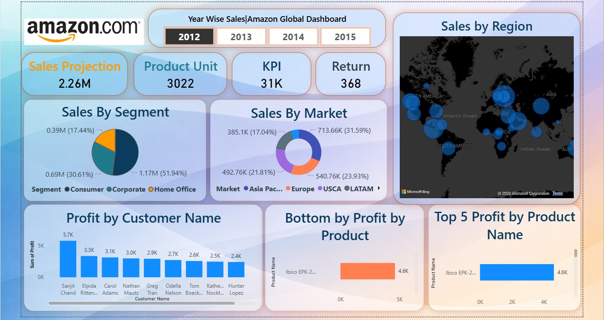

# Amazon Global Sales Dashboard – Power BI

Interactive Power BI dashboard analyzing Amazon global sales data with KPIs, segment analysis, market distribution, customer profit insights, and product performance.

## Features
- KPI Cards: Sales Projection, Product Units, KPI, Returns
- Sales by Segment (Pie)
- Sales by Market (Donut)
- Profit by Customer
- Top 5 & Bottom 5 Products by Profit
- Map visualization by country
- Year-wise slicer filtering

## Tools Used
- Power BI Desktop
- DAX Measures
- Data Modeling
- Visualization Design Principles

## Preview

## Insights
This dashboard helps analyze:
- High and low performing products
- Customer profitability
- Regional sales distribution
- Segment contribution to sales

---
Created by **Suleman Mulani**
